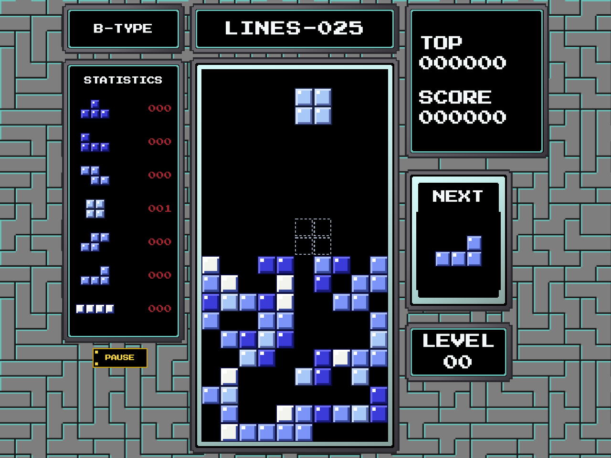
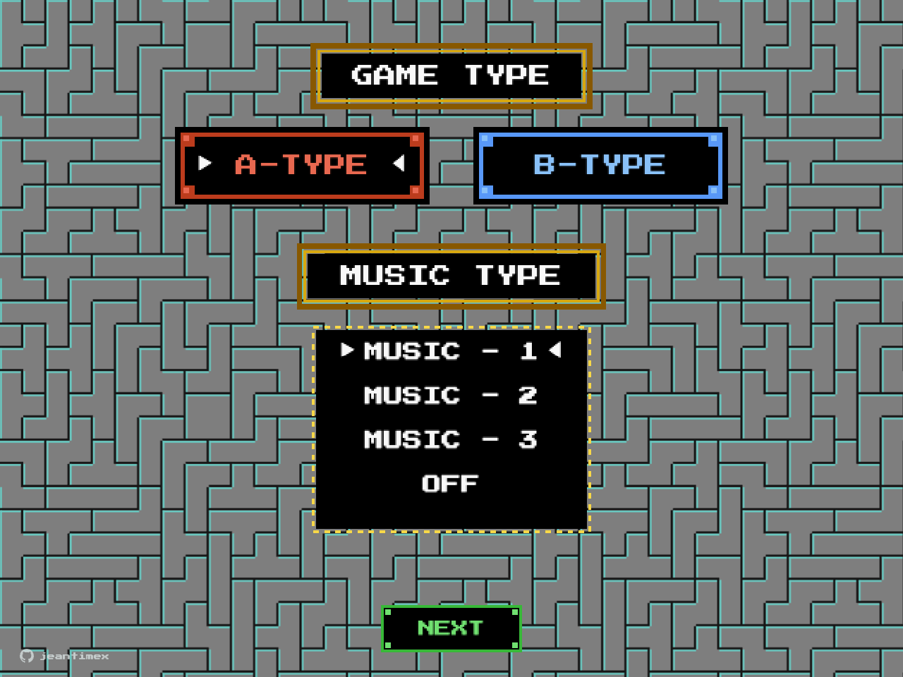
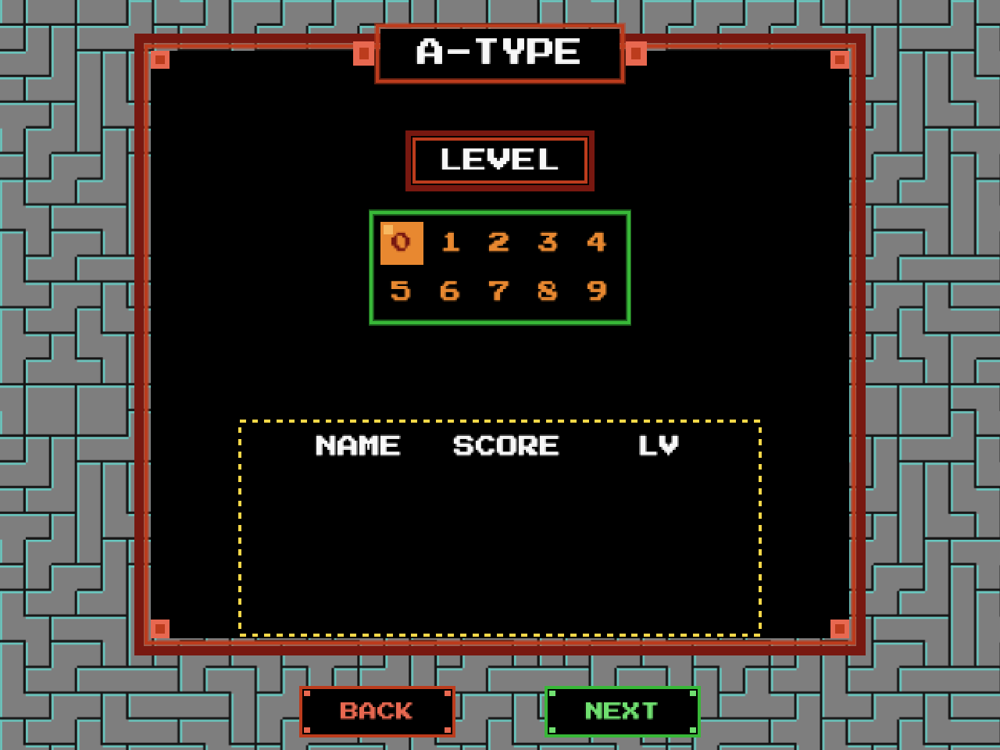
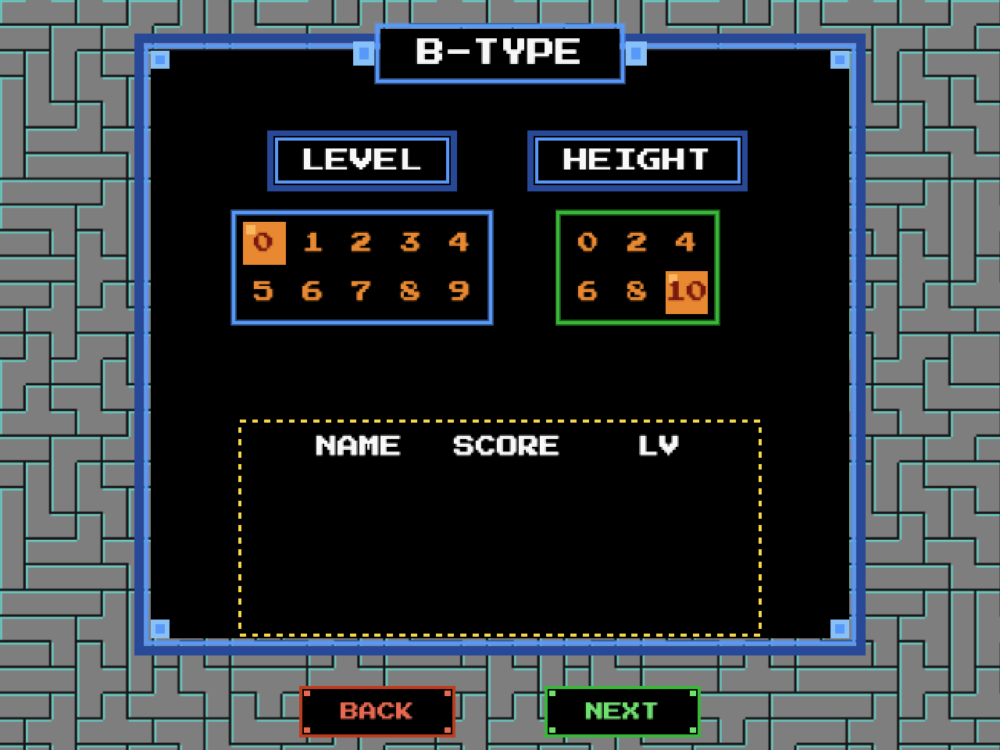
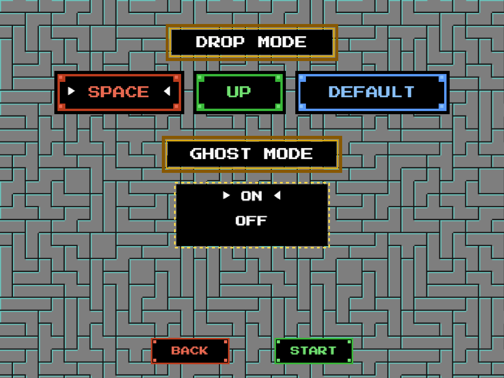
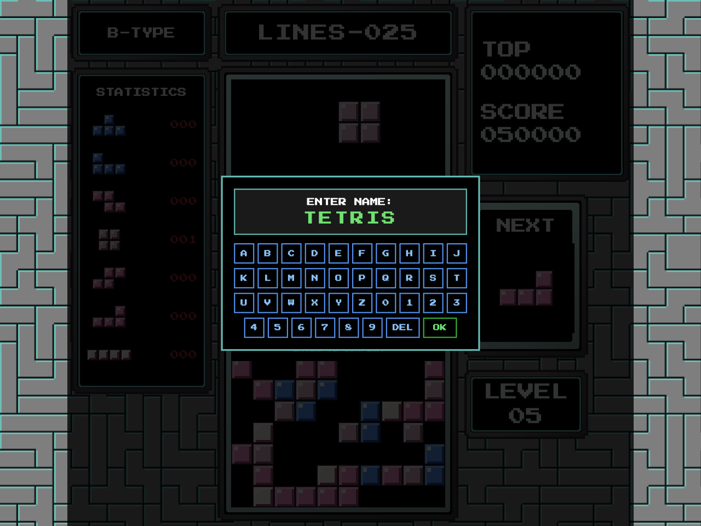

# TETRIS (NES Edition)

A responsive web clone of classic NES Tetris, built with TypeScript, HTML5 Canvas, Vanilla CSS, and Vite.



---

## 🎮 Screenshots

| Game Mode & Music Selection | A-TYPE Level Select |
|:---:|:---:|
|  |  |

| B-TYPE Level & Height Select | Drop & Ghost Settings |
|:---:|:---:|
|  |  |

| B-TYPE Gameplay (Height 5 Garbage) | High Score Name Entry |
|:---:|:---:|
|  |  |

---

## ✨ Features

* **Authentic NES Mechanics**: Features original NES gravity speed tables, entry delays (ARE), soft drop acceleration, and single-reroll piece generation.
* **Game Modes**:
  * **A-TYPE**: Classic marathon mode where speed increases as lines are cleared.
  * **B-TYPE**: Sprint mode with a 25-line goal and selectable garbage height starting levels (0–10 rows).
* **Retro Audio Engine**: 100% Web Audio API synth chiptunes featuring *Korobeiniki* (A-Theme) plus two extra themes and authentic sound effects. Zero audio files or external media required.
* **Procedural Tetromino Wall**: Seamless retro background created via a real-time toroidal backtracking solver that tiles all 7 tetrominoes into an SVG pattern on load.
* **Level Color Palettes**: Block colors dynamically shift every level to match classic NES palette schemes.
* **Responsive & Mobile Friendly**: Scales seamlessly across desktop, tablet, and mobile screens. Features touch/swipe gesture controls and an on-screen retro keyboard for entering high score names.
* **Customizable Settings**: Toggle hard drop keys (`Space`, `Up`, or disabled) and Ghost piece drop guides.

---

## 🕹️ How to Play

### Controls

| Action | Keyboard | Touch / Mobile |
|:---|:---|:---|
| **Move Left / Right** | `←` / `→` (Hold for DAS repeat) | Swipe Left / Right |
| **Rotate Clockwise** | `X` or `Up Arrow` or `Space` | Tap Playfield |
| **Rotate Counter-Clockwise** | `Z` | — |
| **Soft Drop** | `↓` (Hold to accelerate) | Drag Down |
| **Hard Drop** | `Space` or `Up Arrow` *(if configured)* | Swipe Down |
| **Pause / Resume** | `P` or `Esc` | Pause Button |
| **Mute Audio** | `M` | — |
| **Toggle Ghost Piece** | `G` | — |

---

## 🚀 Getting Started

### Prerequisites

* [Node.js](https://nodejs.org/) (v18 or higher)
* `npm`

### Installation & Local Development

1. **Clone the repository**:
   ```bash
   git clone https://github.com/jeantimex/tetris.git
   cd tetris
   ```

2. **Install dependencies**:
   ```bash
   npm install
   ```

3. **Start the development server**:
   ```bash
   npm run dev
   ```

4. **Build for production**:
   ```bash
   npm run build
   ```

5. **Preview the production build**:
   ```bash
   npm run preview
   ```

---

## 🛠️ Tech Stack

* **Language**: TypeScript
* **Rendering**: HTML5 2D Canvas & CSS3
* **Build Tool**: Vite
* **Audio**: Web Audio API (Synthesized Square/Triangle/Noise Oscillators)

---

## 📄 License

This project is open source and available under the [MIT License](LICENSE).
